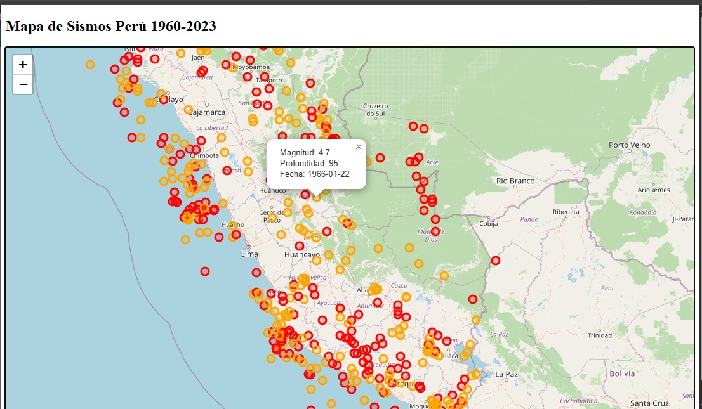

## Visor de Sismos - Perú (Versión 1)

Aplicación web para la visualización de eventos sísmicos en Perú utilizando datos abiertos, base de datos espacial (PostGIS) y un backend en Flask.

Los pasos para replicarlo:

1. Clonar repositorio
2. Crear entorno virtual
3. Instalar dependencias (requirements.txt)
4. Crear archivo .env (basado en .env.example)
5. Configurar variables de entorno 
6. Crear esquema de base de datos (database/schema.sql)
7. Ejecutar carga de datos (scripts/load_data.py)
8. Ejecutar aplicación (python backend/app.py)
9. Probar API (/api/sismos)

Los datos utilizados provienen del:

**Instituto Geofísico del Perú** 
*Catálogo Sísmico desde 1960*

Disponible en:
https://www.datosabiertos.gob.pe/dataset/cat%C3%A1logo-s%C3%ADsmico-desde-1960-instituto-geof%C3%ADsico-del-per%C3%BA-igp
