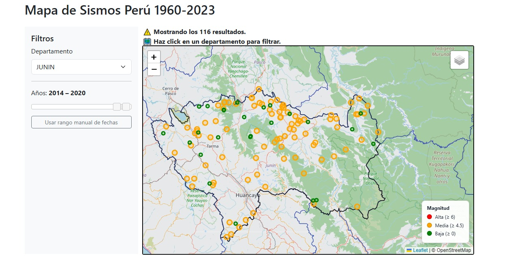

## Visor de Sismos - Perú (Versión 1)

🔗 **Demo en producción:** https://visor-sismos-peru.onrender.com/

Aplicación web para la visualización de eventos sísmicos en Perú utilizando datos abiertos, base de datos espacial (PostGIS) y un backend en Flask con Python 3.12.13.

Los pasos para replicarlo:

1. Clonar repositorio
2. Crear entorno virtual
3. Instalar dependencias (requirements.txt)
4. Crear archivo .env (basado en .env.example)
5. Configurar variables de entorno 
6. Crear esquema de base de datos (Ejecutar database/schema.sql)
7. Ejecutar carga de datos (scripts/load_data.py)
8. Cargar datos espaciales para departamentos
   1. Ejecutar consulta por partes database/seed/departamentos.sql
   2. o Ejecutar el comando shp2pgsql -I -s 4326 data/departamentos.shp | pgsql "TU_CADENA_DE_CONEXION"
9.  Agregar columna departamento para carga más rápida (Ejecutar database/etl/001_add_departamento_column.sql)
10. Asignar departamento a cada sismo (Ejecutar database/etl/002_fill_departamento.sql)
11. Ejecutar aplicación (python backend/app.py)
12. Probar API (/api/sismos)

## 📚 Fuentes y créditos

- Datos sísmicos: Instituto Geofísico del Perú (IGP)  
  https://www.datosabiertos.gob.pe/

- Límites departamentales: shapefile obtenido de IGN
  https://www.datosabiertos.gob.pe/dataset/limites-departamentales

- Base cartográfica: OpenStreetMap  
  © OpenStreetMap contributors