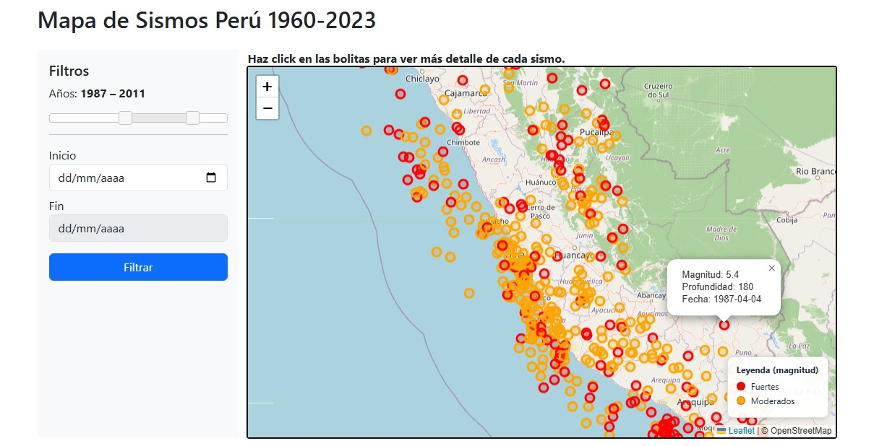

## Visor de Sismos - Perú (Versión 1)

🔗 **Demo en producción:** https://visor-sismos-peru.onrender.com/

Aplicación web para la visualización de eventos sísmicos en Perú utilizando datos abiertos, base de datos espacial (PostGIS) y un backend en Flask con Python 3.12.13.

Los pasos para replicarlo:

1. Clonar repositorio
2. Crear entorno virtual
3. Instalar dependencias (requirements.txt)
4. Crear archivo .env (basado en .env.example)
5. Configurar variables de entorno 
6. Crear esquema de base de datos (database/schema.sql)
7. Ejecutar carga de datos (scripts/load_data.py)
8. Ejecutar aplicación (python backend/app.py)
9. Probar API (/api/sismos)

## 📚 Fuentes y créditos

- Datos sísmicos: Instituto Geofísico del Perú (IGP)  
  https://www.datosabiertos.gob.pe/

- Base cartográfica: OpenStreetMap  
  © OpenStreetMap contributors