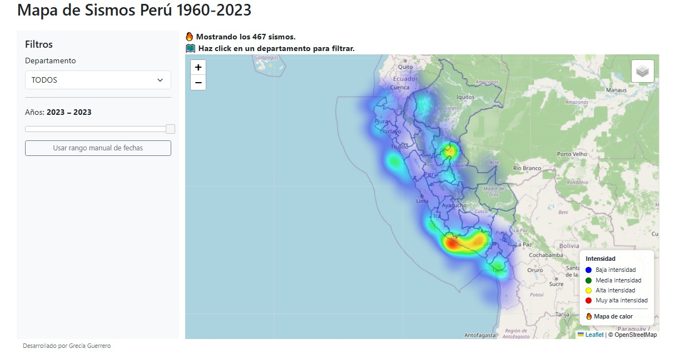

## Visor de Sismos - Perú (Versión 1)

🔗 **Demo en producción:** https://visor-sismos-peru.onrender.com/

Aplicación web para la visualización de eventos sísmicos en Perú utilizando datos abiertos, con un backend desarrollado en **FastAPI**, un frontend con **React + Typescript** y una base de datos espacial **PostgreSQL + PostGIS**

La REST API está versionada bajo `/api/v1` y documentada automáticamente mediante **OpenAPI/Swagger** en `/docs` y `/openapi.json`

Los pasos para replicarlo:

1. Clonar el repositorio
2. Crear entorno virtual con Python 3.12.13
3. Instalar dependencias: pip install -r requirements.txt
4. Crear archivo .env basado en .env.example
5. Configurar variables de entorno
6. Ejecutar las migraciones de Alembic: alembic upgrade head
7. Ejecutar el script de carga de sismos: python scripts/load_earthquakes.py
8. Ejecutar el backend: Desarrollo: uvicorn app.main:app --reload
9. Ejecutar el frontend: Desarrollo: npm run dev

## 📚 Fuentes y créditos

- Datos sísmicos: Instituto Geofísico del Perú (IGP)  
  https://www.datosabiertos.gob.pe/

- Límites departamentales: shapefile obtenido de IGN
  https://www.datosabiertos.gob.pe/dataset/limites-departamentales

- Base cartográfica: OpenStreetMap  
  © OpenStreetMap contributors