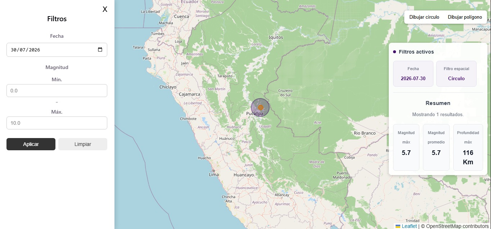

## Visor de Sismos - Perú 

Aplicación web para la visualización de eventos sísmicos en Perú utilizando datos abiertos del Instituto Geofísico del Perú (IGP). 

🔗 **Demo:** https://visor-sismos-peru.netlify.app/

### Arquitectura

El proyecto está compuesto por tres componentes principales:

#### 1. Backend / API
El backend ha sido desarrollado con **FastAPI**, responsable de exponer los endpoints y comunicarse con la base de datos. Se desplegó en **Render**.

- Framework: FastAPI
- SQLAlchemy: ORM para interactuar con PostgreSQL
- Alembic: migraciones de la base de datos
- GeoAlchemy2: integración de datos geoespaciales con PostGIS
- Pydantic: definición y validación de los esquemas/dtos
- Pydantic settings: validación de variables de configuración
- Arquitectura por capas: routers, services, repositories y models
- API versioning: mediante el prefijo /api/v1
- OpenAPI/Swagger: documentación automática
  - https://visor-sismos-peru.onrender.com/docs
  - https://visor-sismos-peru.onrender.com/openapi.json

#### 2. Frontend

El frontend ha sido desarrollado con **React + Typescript**, responsable de la interacción del usuario con el mapa y sus datos. Se desplegó en **Netlify**.

- Framework: React
- Leaflet: visualización cartográfica
- Axios: consumo de la REST API

#### 3. Base de datos

La base de datos espacial ha sido desarrollada en **PostgreSQL + PostGIS** y desplegada en **Supabase**.

El proceso de carga de datos utilizó una tabla staging (staging_earthquakes) donde se validó la información antes de insertarla a la tabla de sismos (earthquakes)

#### A tener en cuenta:
La primera carga de datos puede tardar unos segundos si el backend ha estado inactivo. Esto se debe al servicio de hosting. Las siguientes solicitudes deberían responder con normalidad.

#### Pasos para replicarlo:

1. Clonar el repositorio
2. Crear y activar entorno virtual con `Python 3.12.13`
3. Instalar dependencias
  `pip install -r requirements.txt`
4. Configurar variables de entorno 
  Crear `.env` usando de guía `.env.example`
5. Ejecutar las migraciones desde la carpeta backend
  `cd backend` 
  `alembic upgrade head`
1. Ejecutar el script de carga de sismos desde la raíz del proyecto
  `cd ..`
  `python -m scripts.load_earthquakes`
1. Ejecutar el backend en desarrollo
  `cd backend`
  `uvicorn app.main:app --reload `
1. Ejecutar el frontend en desarrollo
  `cd frontend`
  `npm run dev`

#### 📚 Fuentes y créditos

- Datos sísmicos: Instituto Geofísico del Perú (IGP)  
  https://www.datosabiertos.gob.pe/

- Límites departamentales: shapefile obtenido de IGN
  https://www.datosabiertos.gob.pe/dataset/limites-departamentales

- Base cartográfica: OpenStreetMap  
  © OpenStreetMap contributors